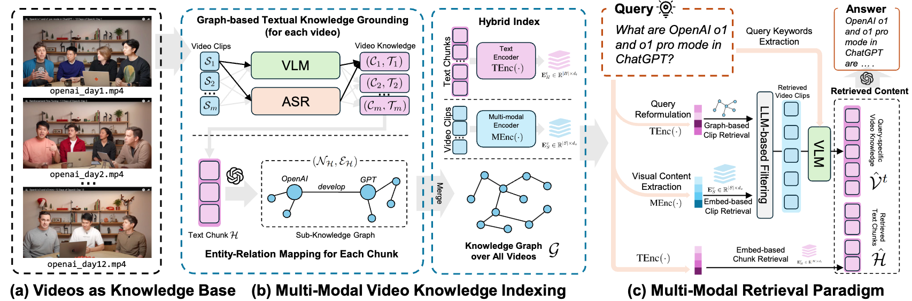

<div align="center">

<br/>


这是论文中提出的 VideoRAG 的 PyTorch 实现：

> **VideoRAG: 超长上下文视频的检索增强生成**
> Xubin Ren*, Lingrui Xu*, Long Xia, Shuaiqiang Wang, Dawei Yin, Chao Huang†

\* 表示同等贡献。
† 表示通讯作者

在这篇论文中，我们提出了一个专门用于处理和理解**超长上下文视频**的检索增强生成框架。

## 📋 目录

- [⚡ VideoRAG 框架](#-videorag-框架)
- [🛠️ 安装](#️-安装)
- [🚀 快速开始](#-快速开始)
- [🧪 实验](#-实验)
- [🦙 Ollama 支持](#-ollama-支持)
- [📖 引用](#-引用)
- [🙏 致谢](#-致谢)

## ⚡ VideoRAG 框架

<p align="center">

</p>

VideoRAG 引入了一种新颖的双通道架构，协同结合图驱动的文本知识奠基来建模跨视频语义关系，以及分层多模态上下文编码来保留时空视觉模式，通过动态构建的知识图谱实现无界限长度的视频理解，该图谱在多视频上下文中保持语义连贯性，同时通过自适应多模态融合机制优化检索效率。

💻 **高效的超长上下文视频处理**

- 利用单个 NVIDIA RTX 3090 GPU (24G) 理解数百小时的视频内容 💪

🗃️ **结构化视频知识索引**

- 多模态知识索引框架将数百小时的视频提炼成简洁、结构化的知识图谱 🗂️

🔍 **多模态检索实现全面回答**

- 多模态检索范式对齐文本语义和视觉内容，识别最相关的视频以提供全面回答 💬

📚 **新建立的 LongerVideos 基准测试**

- 新建立的 LongerVideos 基准测试包含超过 160 个视频，总计 134+ 小时，涵盖讲座、纪录片和娱乐内容 🎬

## 🛠️ 安装

### 📦 环境设置

要使用 VideoRAG，请首先使用以下命令创建 conda 环境：

```bash
# 创建并激活 conda 环境
conda create --name videorag python=3.11
conda activate videorag
```

### 📚 核心依赖

安装 VideoRAG 的核心包：

```bash
# 核心数值和深度学习库
pip install numpy==1.26.4
pip install torch==2.1.2 torchvision==0.16.2 torchaudio==2.1.2
pip install accelerate==0.30.1
pip install bitsandbytes==0.43.1

# 视频处理工具
pip install moviepy==1.0.3
pip install git+https://github.com/facebookresearch/pytorchvideo.git@28fe037d212663c6a24f373b94cc5d478c8c1a1d
pip install --no-deps git+https://github.com/facebookresearch/ImageBind.git@3fcf5c9039de97f6ff5528ee4a9dce903c5979b3

# 多模态和视觉库
pip install timm ftfy regex einops fvcore eva-decord==0.6.1 iopath matplotlib types-regex cartopy

# 音频处理和向量数据库
pip install ctranslate2==4.4.0 faster_whisper==1.0.3 neo4j hnswlib xxhash nano-vectordb

# 语言模型和工具
pip install transformers==4.37.1
pip install tiktoken openai tenacity
pip install ollama==0.5.3
```

### 📥 模型检查点

在**仓库根目录**下载 MiniCPM-V、Whisper 和 ImageBind 所需的检查点：

```bash
# 确保已安装 git-lfs
git lfs install

# 下载 MiniCPM-V 模型
git lfs clone https://huggingface.co/openbmb/MiniCPM-V-2_6-int4

# 下载 Whisper 模型
git lfs clone https://huggingface.co/Systran/faster-distil-whisper-large-v3

# 下载 ImageBind 检查点
mkdir .checkpoints
cd .checkpoints
wget https://dl.fbaipublicfiles.com/imagebind/imagebind_huge.pth
cd ../
```

### 📁 目录结构

下载所有检查点后，您的最终目录结构应如下所示：

```shell
VideoRAG/
├── .checkpoints/
├── faster-distil-whisper-large-v3/
├── LICENSE
├── longervideos/
├── MiniCPM-V-2_6-int4/
├── README.md
├── reproduce/
├── notesbooks/
├── videorag/
├── VideoRAG_cover.png
└── VideoRAG.png
```

## 🚀 快速开始

VideoRAG 能够从多个视频中提取知识并基于这些视频回答查询。现在，使用您自己的视频尝试 VideoRAG 🤗。

> [!NOTE]
> 目前，VideoRAG 仅在英语环境中测试过。要处理多语言视频，建议修改 [asr.py](https://github.com/HKUDS/VideoRAG/blob/main/videorag/_videoutil/asr.py) 中的 ``WhisperModel``。更多详情，请参考 [faster-whisper](https://github.com/systran/faster-whisper)。

**首先**，让 VideoRAG 从给定的视频中提取和索引知识（只需一个 24GB 内存的 GPU，例如 RTX 3090）：

```python
import os
import logging
import warnings
import multiprocessing

warnings.filterwarnings("ignore")
logging.getLogger("httpx").setLevel(logging.WARNING)

# 请输入您的 openai key
os.environ["OPENAI_API_KEY"] = ""

from videorag._llm import openai_4o_mini_config
from videorag import VideoRAG, QueryParam


if __name__ == '__main__':
    multiprocessing.set_start_method('spawn')

    # 请在此列表中输入您的视频文件路径；长度不限。
    # 这是一个示例；您可以使用自己的视频。
    video_paths = [
        'movies/Iron-Man.mp4',
        'movies/Spider-Man.mkv',
    ]
    videorag = VideoRAG(llm=openai_4o_mini_config, working_dir=f"./videorag-workdir")
    videorag.insert_video(video_path_list=video_paths)
```

**然后**，提出关于视频的任何问题！这是一个示例：

```python
import os
import logging
import warnings
import multiprocessing

warnings.filterwarnings("ignore")
logging.getLogger("httpx").setLevel(logging.WARNING)

# 请输入您的 openai key
os.environ["OPENAI_API_KEY"] = ""

from videorag._llm import *
from videorag import VideoRAG, QueryParam


if __name__ == '__main__':
    multiprocessing.set_start_method('spawn')

    query = '钢铁侠和蜘蛛侠之间是什么关系？他们如何相遇，钢铁侠如何帮助蜘蛛侠？'
    param = QueryParam(mode="videorag")
    # 如果 param.wo_reference = False，VideoRAG 将在响应中添加视频片段的引用
    param.wo_reference = True

    videorag = videorag = VideoRAG(llm=openai_4o_mini_config, working_dir=f"./videorag-workdir")
    videorag.load_caption_model(debug=False)
    response = videorag.query(query=query, param=param)
    print(response)
```

## 🧪 实验

### LongerVideos

我们构建了 LongerVideos 基准测试来评估模型在理解多个长上下文视频和回答开放式查询方面的性能。所有视频都是 YouTube 上的开放访问视频，我们在 [JSON](https://github.com/HKUDS/VideoRAG/longervideos/dataset.json) 文件中记录了视频集合的 URL 以及相应的查询。

| 视频类型              | 视频列表数 | 视频数 | 查询数 | 每个列表平均查询数 | 总时长           |
| ----------------------- | ----------: | -----: | -----: | ---------------------: | ----------------- |
| **讲座**       |          12 |    135 |    376 |                   31.3 | ~ 64.3 小时      |
| **纪录片**   |           5 |     12 |    114 |                   22.8 | ~ 28.5 小时      |
| **娱乐** |           5 |     17 |    112 |                   22.4 | ~ 41.9 小时      |
| **全部**           |          22 |    164 |    602 |                   27.4 | ~ 134.6 小时     |

### 使用 VideoRAG 处理 LongerVideos

以下是准备 LongerVideos 中使用的视频的命令参考。

```shell
cd longervideos
python prepare_data.py # 创建集合文件夹
sh download.sh # 获取视频
```

然后，您可以运行以下示例命令来使用 VideoRAG 处理 LongerVideos 并回答查询：

```shell
# 请首先在第 19 行输入您的 openai_key
python run_benchmark.py --collection 4-rag-lecture --cuda 0

或

python run_benchmark.py --collections 0 --backend vllm
```

### 评估

我们分别与基于 RAG 的基线和长上下文视频理解方法进行了胜率比较以及定量比较。**NaiveRAG、GraphRAG 和 LightRAG** 使用 `nano-graphrag` 库实现，与我们的 VideoRAG 一致，确保公平比较。

在这一部分，我们直接提供了**所有方法的答案**（包括 VideoRAG）以及用于实验复现的评估代码。请使用以下命令下载答案：

```shell
cd reproduce
wget https://archive.org/download/videorag/all_answers.zip
unzip all_answers
```

#### 胜率比较

我们与基于 RAG 的基线进行胜率比较。要重现结果，请按照以下步骤操作：

```shell
cd reproduce/winrate_comparison

# 第一步：将批量请求上传到 OpenAI（记得在文件中输入您的密钥，以下步骤相同）。
python batch_winrate_eval_upload.py

# 第二步：下载结果。请在文件中输入批次 ID，然后输入输出文件 ID。通常，您需要运行两次：首先获取输出文件 ID，然后下载它。
python batch_winrate_eval_download.py

# 第三步：解析结果。请在文件中输入输出文件 ID。
python batch_winrate_eval_parse.py

# 第四步：计算结果。请在文件中输入解析结果文件名。
python batch_winrate_eval_calculate.py

```

#### 定量比较

我们进行定量比较，通过为长上下文视频理解方法分配 5 分制评分来扩展胜率比较。我们使用 NaiveRAG 的答案作为每个查询评分的基线响应。要重现结果，请按照以下步骤操作：

```shell
cd reproduce/quantitative_comparison

# 第一步：将批量请求上传到 OpenAI（记得在文件中输入您的密钥，以下步骤相同）。
python batch_quant_eval_upload.py

# 第二步：下载结果。请在文件中输入批次 ID，然后输入输出文件 ID。通常，您需要运行两次：首先获取输出文件 ID，然后下载它。
python batch_quant_eval_download.py

# 第三步：解析结果。请在文件中输入输出文件 ID。
python batch_quant_eval_parse.py

# 第四步：计算结果。请在文件中输入解析结果文件名。
python batch_quant_eval_calculate.py
```

## 🦙 Ollama 支持

本项目也支持 ollama。要使用，请编辑 [_llm.py](https://github.com/HKUDS/VideoRAG/blob/main/videorag/_llm.py) 中的 ollama_config。
调整正在使用的模型参数

```
ollama_config = LLMConfig(
    embedding_func_raw = ollama_embedding,
    embedding_model_name = "nomic-embed-text",
    embedding_dim = 768,
    embedding_max_token_size=8192,
    embedding_batch_num = 1,
    embedding_func_max_async = 1,
    query_better_than_threshold = 0.2,
    best_model_func_raw = ollama_complete ,
    best_model_name = "gemma2:latest", # 需要是一个可靠的指令模型
    best_model_max_token_size = 32768,
    best_model_max_async  = 1,
    cheap_model_func_raw = ollama_mini_complete,
    cheap_model_name = "olmo2",
    cheap_model_max_token_size = 32768,
    cheap_model_max_async = 1
)
```

并在创建 VideoRag 实例时指定配置

### Jupyter Notebook

要在单个视频上测试解决方案，只需加载 [notebook 文件夹](VideoRAG/nodebooks) 中的笔记本并
更新参数以适合您的情况。

## 📖 引用

如果您发现这项工作对您的研究有帮助，请考虑引用我们的论文：

```bibtex
@article{VideoRAG,
  title={VideoRAG: Retrieval-Augmented Generation with Extreme Long-Context Videos},
  author={Ren, Xubin and Xu, Lingrui and Xia, Long and Wang, Shuaiqiang and Yin, Dawei and Huang, Chao},
  journal={arXiv preprint arXiv:2502.01549},
  year={2025}
}
```

## 🙏 致谢

我们对开源社区和使 VideoRAG 成为可能的基础项目表示衷心感谢。特别感谢 [nano-graphrag](https://github.com/gusye1234/nano-graphrag) 和 [LightRAG](https://github.com/HKUDS/LightRAG) 的创建者和维护者在基于图的检索系统方面的开创性工作。

我们的框架建立在这些杰出项目的集体智慧之上，我们很荣幸能为多模态 AI 研究的进步做出贡献。我们也感谢更广泛的研究社区继续致力于推动视频理解和检索增强生成的边界。

**🌟 感谢您对我们工作的关注！让我们一起塑造智能视频 AI 的未来。🌟**
